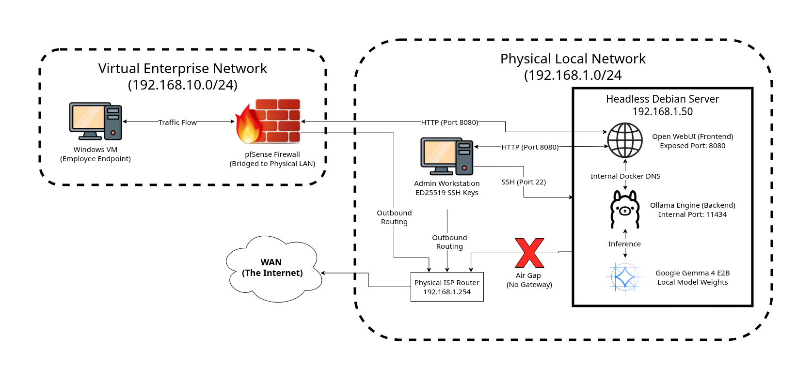
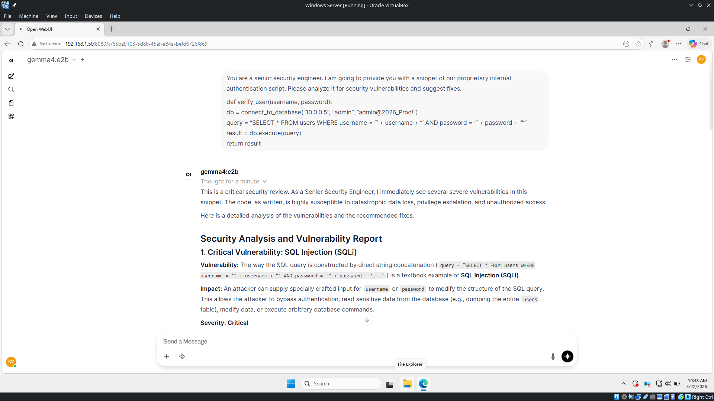

# Air-Gapped Enterprise AI Node

This project demonstrates the deployment of a locally-hosted, containerized Large Language Model (Google Gemma 4 E2B) on a headless bare-metal Debian server. By utilizing host-based gateway nullification, this node operates entirely air-gapped from the internet, providing a secure AI assistant for internal staff while mitigating Data Loss Prevention (DLP) risks.

## Architecture Overview

The system runs on a headless Debian host with the following security boundaries:
*   **Total Air-Gap:** The default gateway is nullified inside the network interface configuration, strictly preventing outbound WAN traffic.
*   **Container Isolation:** The inference engine (Ollama) is isolated on an internal Docker bridge network (Port 11434) and is only reachable by the frontend UI container. Only the Open WebUI frontend (Port 8080) is exposed to the local LAN.
*   **Hardened Remote Access:** SSH password authentication is completely disabled, requiring authorized ED25519 keypairs for administration.



## Enterprise Lab Integration

Rather than operating as a standalone project, this node is integrated directly into a wider lab environment established in previous projects:
*   **Project 1 (Virtual Network Topology):** The physical Debian host is bridged into the virtual LAN zone managed by the virtual **pfSense firewall**. 
*   **Project 2 (Active Directory & Hardened Endpoints):** The secure AI frontend (Port 8080) is accessed by the hardened **Windows 10 VMs** residing on the domain.

This integration allows domain endpoints to utilize AI capabilities without any data leaving the private enterprise network.

## Tech Stack

*   **Operating System:** Debian Linux (Headless, Bare-Metal)
*   **DevSecOps:** Docker & Docker Compose
*   **Backend AI Engine:** Ollama (serving Google Gemma 4 E2B)
*   **Frontend UI:** Open WebUI
*   **Network Security:** Host-Based Gateway Nullification
*   **Hardware Used:** Old Asus Laptop (Intel i5-8250U 8GB RAM)

## How to Deploy

### 1. Bootstrap the Inference Engine
Before air-gapping the system, connect the server to the internet to download the Docker images and model weights:

```bash
# Clone the repository
git clone https://github.com/jingyanggggg/on-premise-enterprise-llm.git
cd on-premise-enterprise-llm

# Start the services
docker compose up -d

# Pull the edge-optimized model weights
docker exec -it enterprise_ollama ollama run gemma4:e2b
```
*(Once downloaded, type `/bye` to exit the Ollama CLI)*

### 2. Enforce the Host-Level Air-Gap
Edit the network configuration file on the Debian server:

```bash
sudo nano /etc/network/interfaces
```

Configure static IP for Debian server and comment out the default gateway line:

```text
allow-hotplug enp3s0
iface enp3s0 inet static
    address 192.168.1.50
    netmask 255.255.255.0
    # gateway 192.168.1.254 <--- Disabled to enforce the air-gap
    dns-nameservers 1.1.1.1 8.8.8.8
```

Save the file and reboot:

```bash
sudo reboot
```

### 3. Verification
Verify that the host can no longer reach external networks while local access remains functional:

```bash
# Verify the air-gap from the Debian terminal (Should fail)
ping -c 4 8.8.8.8

# Access the AI UI from your Windows 10 VM (Project 2) or Admin Workstation
http://192.168.1.50:8080
```

## Proof of Concept
Prompting the model to analyze a simple script through the Open WebUI interface. The request is fulfilled locally by the remote Debian server.



